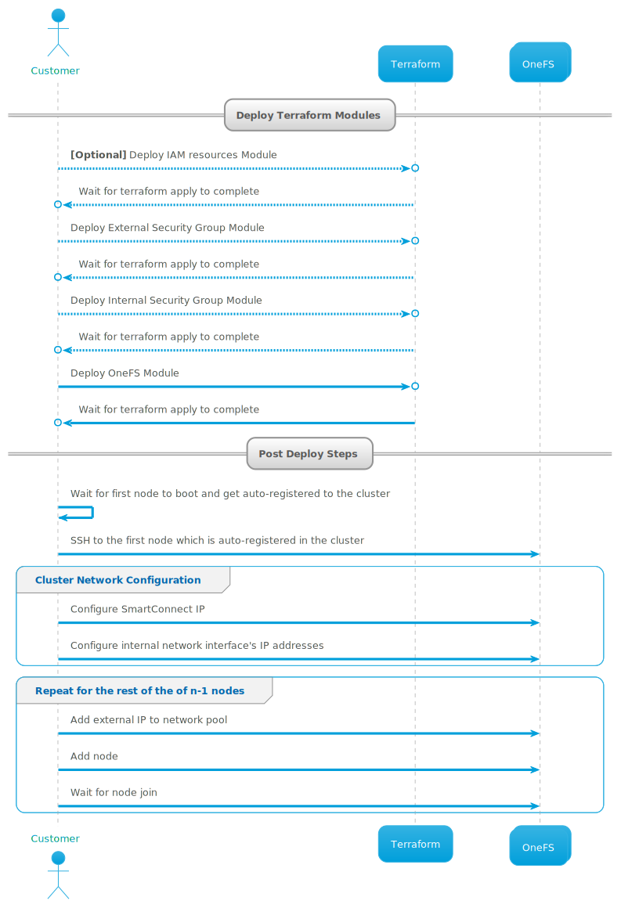

<!--

        Copyright (c) 2023 Dell, Inc or its subsidiaries.

        This Source Code Form is subject to the terms of the Mozilla Public
        License, v. 2.0. If a copy of the MPL was not distributed with this
        file, You can obtain one at https://mozilla.org/MPL/2.0/.

-->
# Deploy A PowerScale Cluster

The [terraform configuration file](main.tf) has been provided as an example module to deploy a PowerScale cluster.

## Sequence Diagram


## Description

Create the `terraform.tfvars.json` file and provide the following required input variables in that file:
```json
{
    "nodes": 4,
    "image_id": "ami-#################",
    "vpc_id": "vpc-#################",
    "internal_subnet_id": "subnet-#################",
    "external_subnet_id": "subnet-#################",
    "credentials_hashed": true,
    "default_hashed_password": "********"
}

```
> **NOTE**: Kindly ensure that you have a [VPC](https://docs.aws.amazon.com/vpc/latest/userguide/what-is-amazon-vpc.html) and two [subnets](https://docs.aws.amazon.com/vpc/latest/userguide/configure-subnets.html) for the external and internal subnets created beforehand while deploying this example module. Additionally, based on the use-case, you can also create a third subnet in your VPC which can be used as the management subnet.

Replace the values of `image_id`, `vpc_id`, `internal_subnet_id`, `external_subnet_id`, `default_hashed_password`, etc.
In case, you also have a management subnet, make sure that you update the value for `enable_mgmt` as `true` and provide the management subnet id using the `mgmt_subnet_id` input variable, and management security group id using `mgmt_sg_id`.

For using a pre-existing [IAM instance profile](https://docs.aws.amazon.com/IAM/latest/UserGuide/id_roles_use_switch-role-ec2_instance-profiles.html), provide the name of that IAM instance profile to the `iam_instance_profile` input variable. If not provided, it will deploy the [IAM resources module](../../modules/iam-resources/).

For using a pre-existing External Security Group, provide the security group ID to the `external_sg_id` input variable. If not provided, it will deploy the [External Security Group module](../../modules/ext-security-group/).

For using a pre-existing Internal Security Group, provide the security group ID to the `internal_sg_id` input variable. If not provided, it will deploy the [Internal Security Group module](../../modules/int-security-group/).

> **NOTE**: You can use the same external subnet and external security group for more than one PowerScale cluster as long as there are IP address(es) available to fulfill the requirements of the cluster(s). However, the internal subnet and internal security group that you use should always be specific to each PowerScale cluster.

If you are using the [example modules](../) to create the security groups, make sure you provide the same Cluster Id as obtained from the output of those modules as input to the `cluster_id` input variable.

### Admin and Root User Password

On using the `default_hashed_password` input parameter, both the root and admin user will be assigned the same password as provided in `default_hashed_password`.

You can pass separate passwords for the root and admin user using `root_passphrase` and `admin_passphrase` respectively.

To get the hashed password you can use [openssl-passwd](https://www.openssl.org/docs/man3.0/man1/openssl-passwd.html#:~:text=DESCRIPTION,or%20from%20the%20terminal%20otherwise.) utility.

<details>
<summary>Click to expand steps to generate hashed password</summary>

You can use the following commands to get the hashed password:
```shell
openssl passwd -5 -salt `head -c 8 /dev/random | xxd -p` "<replace-password-here>"
```

In the above command, `head -c 8 /dev/random | xxd -p` is used to generate an 8 byte random string in its hexadecimal representation which is used as the salt for producing the hashed output.
</details>


> NOTE: It is **strongly recommended** that hashed password(s) are used for deploying the PowerScale clusters.
For testing purposes, you can provide the password(s) in plain-text format using the `default_plain_text_password` or `admin_password` and `root_password`. On using the `default_plain_text_password` parameter, both the root and admin user will be assigned the same password. To use separate passwords for the admin and root user use `admin_password` and `root_password` respectively. Additionally, if the passwords are provided in plain-text format, make sure that the `credentials_hashed` parameter is set as `false`.<br><br> The `default_plain_text_password` and `default_hashed_password` are only available in this example module. The [PowerScale Cluster](../../docs/POWERSCALE_CLUSTER.md) does not have that option. While deploying that module, use the respective password parameters for the root and admin users.


For the complete set of input variables that can be provided, check the [variables.tf](variables.tf) file.

## Deploy Terraform modules

Download the terraform provider and configure modules using:

```shell
terraform init
```

To apply the changes run:

```shell
terraform apply -auto-approve
```

## Add Cluster Network Configurations and Join nodes

To add the rest of the OneFS nodes, follow the steps mentioned in this [document](../../docs/POST_DEPLOY_STEPS.md).
